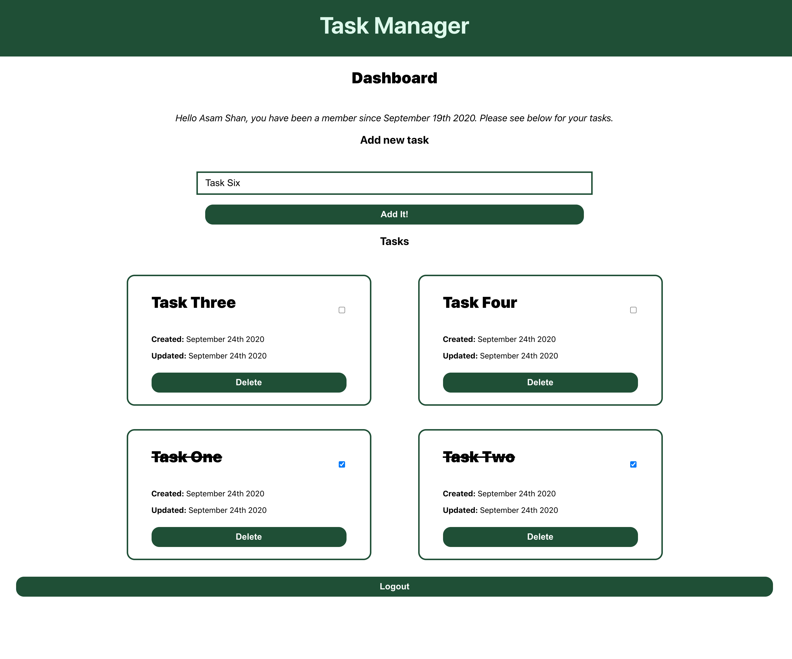
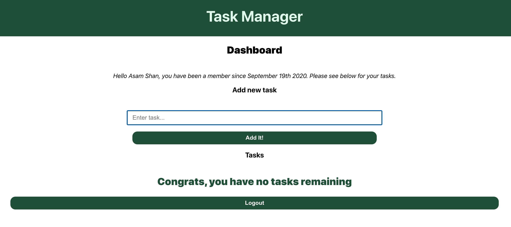
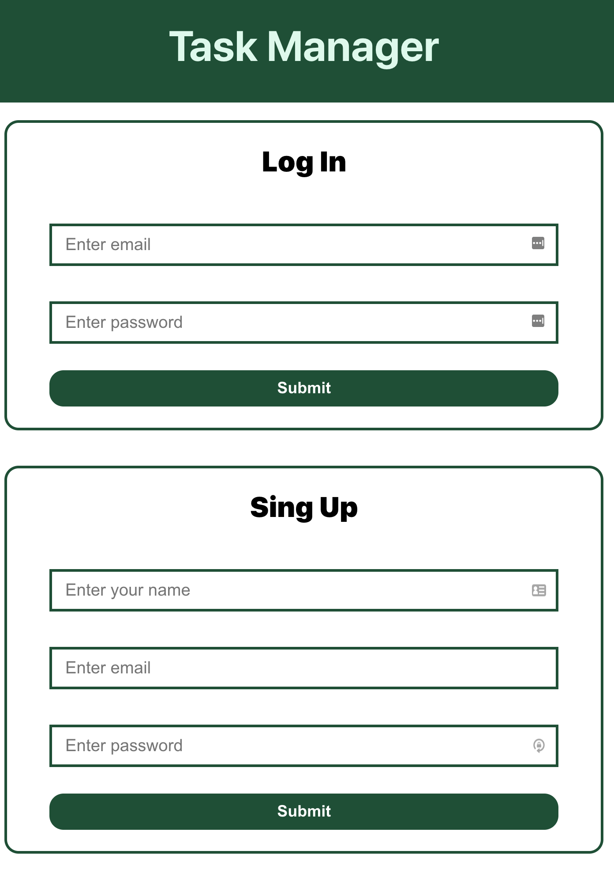

# Task Manager Frontend

Frontend for a note taking application that consumes my nodejs application which can be found [here](https://github.com/shan5742/node-task-manager).

## NOTE: This repo is a WIP

There are likely many bugs in the code as I am still actively developing it. New feature plans are added to the _Still to come section_.

### Features

- Ability to log in and out of the app
- Add new tasks
- Update tasks
- Delete tasks

### Still to come

This is a very basic implementation so far. I plan to add a more robust profile section that includes uploading a profile picture for the user and the ability to edit said profile as well as the ability to update the description of tasks. As this is a WIP there are also some bugs present, which I am aware of, I will get to these as I can.

### Screenshots

